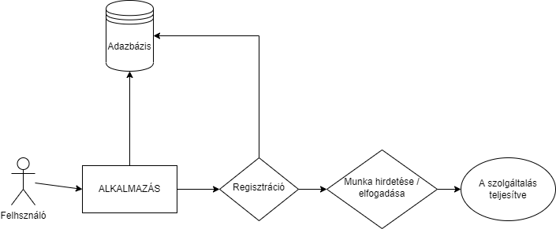

# Rendszerterv

## 1. Bevezetés
A projekt célja egy olyan asztali alkalmazás létrehozása amivel egy "freelancing/szabadúszó munkavállaló" alkalmazás
kinézetét és szerkezeti működését tudjuk lemodellezni egy valóságtól elrugaszkodott példával.
2 féle "szerepet" tölthetnek be a profillal rendelkező felhasználók: az emberek, mint munkaadók és a
vajákok mint munkavállalók. Továbbá jelen lesz még egy 3. felhasznalói szerep is, a moderátoroké, vagy adminoké,
akik eldönthetik hogy melyik munka kerülhet ki.

## 2. Projektterv
Az alkalmazásban az adminoknak van a legnagyobb jogköre. Nekik ellenőrizni kell a kiírandó munkáknak a valódiságát (nehézség és jutalom szempontjából)
Elfogadhatja és elutasíthatja a kiírandó munkákat. Aztán jönnek a munkaadó és munkavállaló jogkörök. Míg a munkaadó csak munkákat tud kiírni (természetesen kikerülés előtt az adminok ezeket ellenőrzik),addig a munkavállalók elvállalhatnak és kiírhatnak munkákat.

## 3. Üzleti folyamatok modellje
### Jelenlegi üzleti folyamatok modellje:
Az alkalmazás a "szabadúszó dolgozóknak" a munkakeresését, a "munkaadók" problémáinak (kiadandó munkáinak) gyorsabb és hatékonyabb megoldását hivatott megkönnyíteni. A munkaadónak van egy speciális problémája amit saját maga nem feltétlen tud megoldnai, ehhez pedig egy céget nem feltétlen keresne meg, mivel sokkal több papírmunkát és kötelezően betartandó protokollt hordozna magával ami igen csak időigényes és lehet hogy sokkal nagyobb probléma történne procedúra alatt eltelt időben.

### Igényelt üzleti folyamatok modellje:
Az általunk kínált megoldással azonban ez a folyamat leegyszerűsödne. Emellett a régi rendszer is a már megszokott rendben tudna üzemelni. Viszont személyes megjelenést az elején nem igényel, illetve a nyitvatartási időt is figyelmen kívül lehet hagyni. Az ügyfél (legyen ez munkaadó / munkavállaló) létrehoz egy profilt az alkalmazáson belül ahol az alábbiakat kell megadnia:
- leendő felhasználó nevét
- jelszavát (amit titkosítunk)
- és a szerepkörét (munkát keres / kínál, admint nem kaphat a felhasználó)

A többi jogi dologgal pedig a cégünk foglalkozik.

## 4. Funkcionális leírás
Az összes ügyfél számára láthatóak a munkák, viszont azok csak az adminok jóváhagyása után kerülhetnek ki az alkalmazásra. Ugyanígy ezeket csak az adminok tudják módosítani és törölni.
Leggyakoribb használata azonban mégis az ügyfelek által fog megtörténni.

## 5. Fizikai környezet
Az alkalmazás Windows operációs rendszeren képes lesz elfutni, mivel egy egyszerűbb Java asztali alkalmazásról van szó. Ebből adódóan nem igényel hatalmas erőforrásokat, egy kétmagos processzor, valamint 2-4GB memóriával (RAM) rendelkező számitógép/laptop képes hiba nélkül futtatni az alkalmazást.

## 6. Követelmények

   * **Funkcionális követelmények:**

       - A felhasználók adatainak eltárolása
       - A munkák adatainak eltárolása
       - A munkák közötti keresés megvalósítása
       - A munkák kiírásának kialakítása
       - A munkák elfogadásának kialakítása

   * **Nemfunkcionális követelmények:**

       - A rendszernek egyszerre több felhasználót kell kiszolgálnia
       - Igényes megjelenítés

## 7. Absztrakt domain modellje

## 8. Architektúrális terv
Az architektúrális tervnek a funkcionális követelményeken túl fontos elemét képezik a rendszer használatát befolyásoló tényezők is. Az adatok tárolását adatbázisok segítségével biztosítjuk így rugalmasság szempontjából a későbbi bővítésekre is felkészültünk. Emellett valós időben több felhasználót tud biztonságosan kezelni egyszerre. 
A felhasználók karbantartása is megvalósul. A hosszú ideje inaktív felhasználók előszöt email-ban értesítést kapnak majd ha erre sem reagálnak akkor a rendszerből törölve lesznek, így helyet szabadít fel a jövendőbeli felhasználóknak.
Másik erőssége az alkalmazásnak, hogy az üzemeltetése egyszerű. Az esetleges szerver meghibásodás vagy szolgáltató váltás esetén gond nélkül áttelepíthető másik állomásra. 
A mai korban elengedhetetlen követelmény a biztonság. Ezt a különböző felhasználói jogosultságokkal érhető el. Ennek köszönhetően a látogatók nem tudják az autók adatait módosítani valamint nem férhetnek hozzá bizalmas információkhoz. A felhasználók kezelése a token rendszerrel valósul meg.

## 9.Implementációs terv
Az asztali alkalmazás felülete JavaFX-el(fxml-ek segítségével) készül. Az elemeket CSS fájlok segítségével dizájnoljuk. A termékek és a felhasználók tárolására szükség van adatbázisra is. Az app backend részét Java nyelven valósítjuk meg. A fájlokat külön választjuk, az átláthatóság és az egyszerűbb bővítés érdekében.

## 10.Tesztelési terv
A tesztelés során az alkalmazásban megvalósított funkciók működését figyeljük. A teszteléssel a különböző hibák megtalálása a cél.
 A teszteléseket a unit tesztek segítségével fogjuk elvégezni, valamint utólag
 egy tesztelési dokumentáció is fog készülni amit a csapatunk eggyik tagja fgo elvégezni és dokumentálni.
 A dokumentum táblázatos formában beküldendő.

